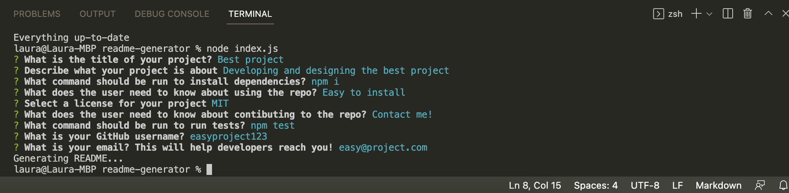

# README Generator

[](https://opensource.org/licenses/MIT)

## Description
This application helps developers to quickly generate a README boilerplate and populate it with basic information.

Here's the link to how it works: [click here](https://youtu.be/h-LH59d7soE)

## Screenshots
The functionality:


# Table of Contents
* [Installation](#installation)
* [Usage](#usage)
* [License](#license)
* [Contributing](#contributing)
* [Tests](#tests)
* [Technologies Used](#technologies-used)
* [Code Snippets](#code-snippets)
* [Questions](#questions)
* [User Information](#user-information)

## Installation
To install necessary dependencies, run the following command:
```
npm i
```

## Usage
Install the dependencies and you're ready to go

## License 
This project is licensed under the MIT license.

## Contributing
Contact me

## Tests
To run tests, run the following command:
```
npm test
```

## Technologies Used
- Node.js

## Code Snippets
```javascript
// Function to write README file
function writeToFile(fileName, data) {
    fs.writeFile(fileName, generateMarkdown(data), err => {
        if (err) console.log(err);
        // Message to log after user completes questionnaire and while file is developing
        console.log("Generating README...");
    })
}

// Function to initialize app
function init() {
    inquirer.prompt(questions).then(answers => {
        // Pass user's answers and file path to generate README
        writeToFile("./test/README.md", answers);
    })
}

// Function call to initialize app
init();
```
The `init()` function resolves the inquirer prompt (which returns a promise) with the users inputs. With this data, we can pass it into the `writeToFile()` function, along with the path and file name of what we are generating. In `writeToFile()`, we are using the file system's built-in method to generate the file. The `generateMarkdown()` function parses through the user's inputs to create a README boilerplate with their data.

## Questions
If you have any questions about the repo, open an issue or contact me directly at laura.sierra17@gmail.com.
You can find more of my work at [laurasierra17](https://www.github.com/laurasierra17).

## User Information
- [LinkedIn](https://www.linkedin.com/in/laurasierra2022)
- [Portfolio](http://www.laura-sierra.com)
